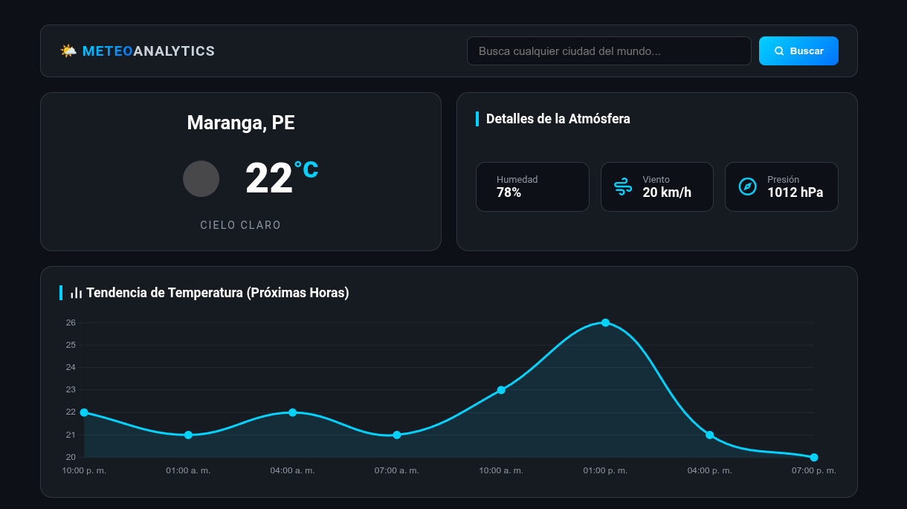

# 🌤️ MeteoAnalytics - Dashboard Climático Analítico

Una aplicación web interactiva estilo Dashboard (Modo Oscuro) diseñada para visualizar, monitorear y analizar variables meteorológicas en tiempo real. El proyecto combina el uso de hardware del dispositivo mediante geolocalización nativa, consumo síncrono/paralelo de APIs climáticas y la representación gráfica de datos temporales mediante gráficos lineales interactivos.

---



## 🚀 Características Destacadas

- **Geolocalización Nativa Activa:** Implementación de la API `navigator.geolocation` del navegador para capturar las coordenadas exactas del usuario (con su previo consentimiento) y automatizar la carga climática inicial.
- **Orquestación Asíncrona Eficiente:** Consumo en paralelo de múltiples endpoints de la API REST de *OpenWeatherMap* (*Current Weather* y *5 Day Forecast*) mediante `Promise.all()`, optimizando los tiempos de respuesta y reduciendo la latencia de carga.
- **Panel Analítico Temporal:** Integración de la librería *Chart.js* para renderizar un gráfico lineal elástico y reactivo, graficando las tendencias de temperatura proyectadas para las próximas horas.
- **Búsqueda Global Dinámica:** Barra de navegación con soporte para eventos de teclado (`Enter`) y clics, permitiendo la consulta instantánea de cualquier ciudad del mundo con sanitización de strings mediante `encodeURIComponent`.
- **Arquitectura UI Elástica:** Interfaz responsiva diseñada desde cero con CSS Grid y Flexbox bajo una paleta de colores en modo oscuro premium, optimizada tanto para monitores de escritorio como para dispositivos móviles.

---

## 🛠️ Tecnologías Utilizadas

- **HTML5:** Estructuración semántica de componentes analíticos, canvas gráficos y layouts de datos.
- **CSS3 Avanzado:** Uso de variables nativas (`:root`), layouts bidimensionales (Grid/Flexbox) y Media Queries para un diseño adaptivo fluido.
- **JavaScript Moderno (ES6+):** Manipulación dinámica del DOM, gestión de asincronía avanzada (`Async/Await`), desestructuración de objetos JSON y algoritmos de formateo de tiempo local.
- **Chart.js:** Librería externa de visualización de datos utilizada para el modelado matemático y renderizado de la curva de temperatura.
- **OpenWeatherMap API:** Motor de datos global utilizado para extraer métricas atmosféricas reales.

---

## 📂 Estructura del Proyecto

```text
Dashboard-Clima-Analitico/
│
├── css/
│   └── style.css       # Estilos estructurales del Dashboard y Media Queries
├── js/
│   └── app.js          # Motor de geolocalización, asincronía y lógica analítica
├── index.html          # Esqueleto semántico de la SPA
└── README.md           # Documentación técnica del proyecto
```
🔧 Inicialización Local y Configuración Segura
1. Clona este repositorio:
```
git clone 
cd Dashboard-Clima-Analitico
```

2. Abre el archivo js/app.js y coloca tu API Key en la variable de configuración si deseas realizar pruebas en un entorno local tradicional:

```
const API_KEY = "TU_API_KEY_AQUÍ";
```

3. Ejecuta el archivo index.html utilizando la extensión Live Server en Visual Studio Code.